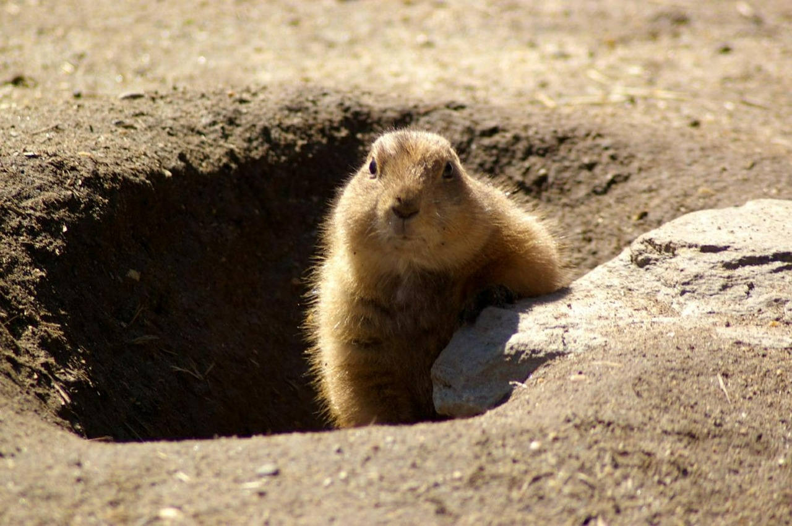

Americans seem to think that a rodent can predict the weather several weeks ahead. It's like a living version of the Farmer's Almanac.

    

It's interesting that only groundhogs have this fortune-telling power. Maybe mice, raccoons, and lemurs could do it if given a chance?
